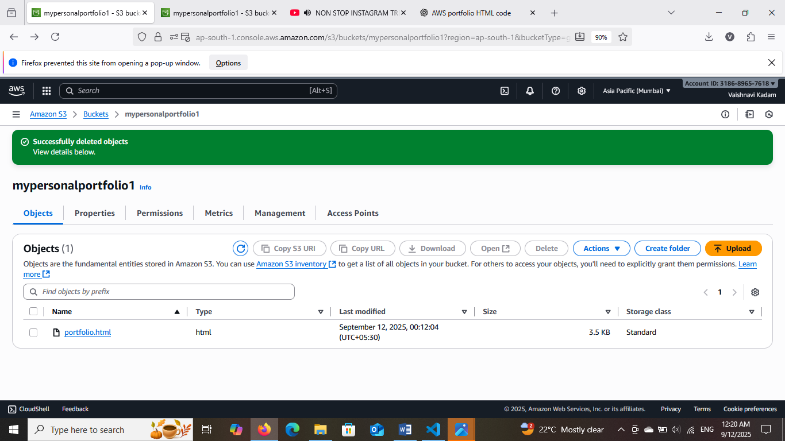
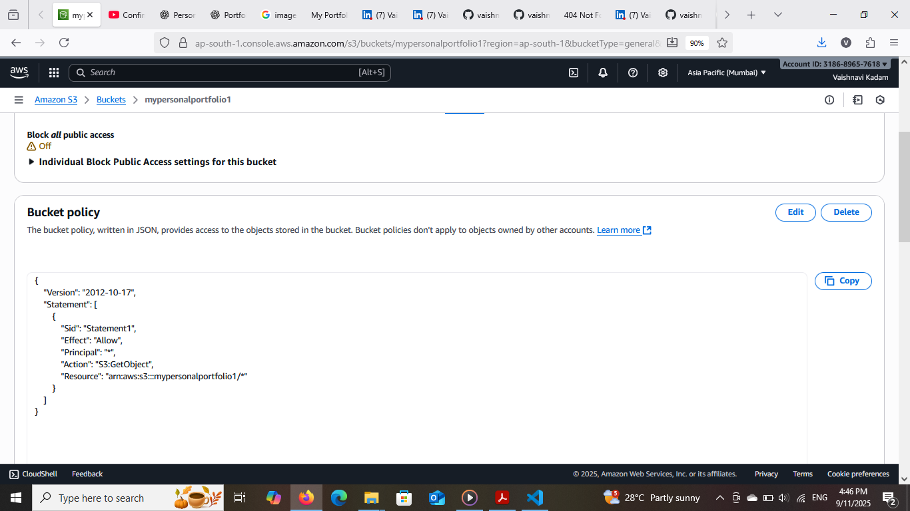
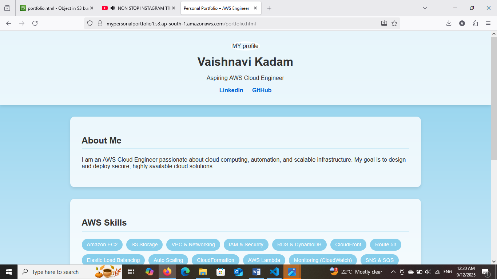
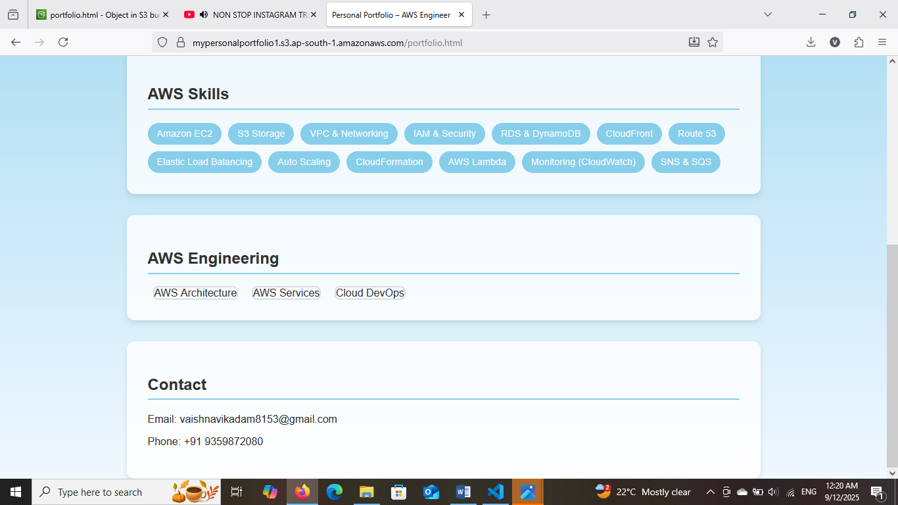

# Personal Portfolio Website on AWS S3

## 📌 Project Overview

This project is a Personal Portfolio Website created using simple HTML and CSS files (portfolio.html and profile.css).
The website is hosted on Amazon S3 as a static website.

## 🛠️ Tech Stack

HTML5 – Structure of the portfolio

CSS3 – Styling and layout

AWS S3 – Static website hosting

AWS IAM – Access management

Bucket Policy – Public access for website files

## 📂 Project Structure

portfolio-project/

│── portfolio.html 

│── profile.css   

## 🚀 Steps to Deploy on AWS S3

Create S3 Bucket

Go to AWS S3 console

Create a bucket (example: my-portfolio-bucket)

Disable Block all public access

Upload Files

Upload portfolio.html and profile.css to the bucket

Enable Static Website Hosting

In bucket → Properties → Enable Static website hosting

Index document → portfolio.html

Make Files Public

### Use Object permissions or add Bucket Policy:

## Access Website

Use the generated S3 Website Endpoint:

http://my-portfolio-bucket.s3-website-<region>.amazonaws.com

## ✨ Future Improvements

Add CloudFront + SSL for HTTPS

Connect with custom domain using Route 53

Add JavaScript for interactivity

## 🔹 Conclusion

This project demonstrates how to build and deploy a static personal portfolio website using **Amazon S3**. It highlights the use of **cloud services for hosting**, making the website highly available, cost-effective, and scalable. By completing this project, I gained hands-on experience with **AWS S3, IAM, CloudFront, and Route 53**, along with practical knowledge of deploying frontend web applications on the cloud. This portfolio not only showcases my projects and skills but also serves as proof of my ability to implement real-world cloud solutions.
